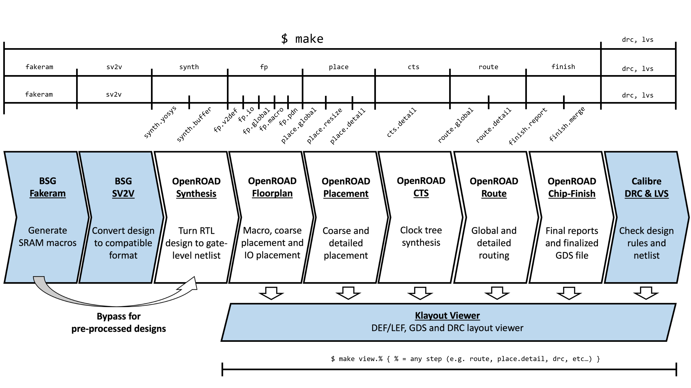

# UW OpenROAD Free45

The UW OpenROAD Free45 CAD flow is an open-source RTL to GDS work flow that
leverages the [OpenROAD Project](https://theopenroadproject.org/) as the main
EDA tool to implement ASIC designs using the
[FreePDK45](https://www.eda.ncsu.edu/wiki/FreePDK45:Contents) and [Nangate open
cell library](http://www.si2.org/open-cell-library/) as the process technology.

## Free45nm PDK and Standard Cell Library

Before you start using the CAD flow, you will need to download the PDK and
standard cell library. Below are the link for the two kits that you will need
to download and place inside the `pdk/` directory.

1. FreePDK45 v1.4 - [ncsu-FreePDK45-1.4.tar.gz](https://www.eda.ncsu.edu/wiki/FreePDK45:Contents)
2. Nangate open cell library v2010.12 - [NangateOpenCellLibrary_PDKv1_3_v2010_12.tgz](http://www.si2.org/open-cell-library/)

## Makefile Setup (`Makefile.setup`)

The only file in the reference flow you need to modify is `Makefile.setup`.
This is a very simple partial makefile that contains the path to the design
that you would like to build as well as optional tool paths for using the
bsg_sv2v and signoff drc/lvs sections of the flow.

## Getting Started - GCD

Included with this flow are two tiny GCD examples which can be found in the
`examples/` directory. These examples are designed to get new users up and
running as quick as possible and can be used as a starting point for
implementing their own designs.

The first gcd example (`examples/gcd_sverilog`) is written in SystemVerilog and
will utilize bsg_sv2v to convert the design into a usable format. This example
has inputs that are more human-readable but requires access to Synopsys
DesignCompiler in order to run bsg_sv2v.  Alternatively, there is the second
gcd example (`examples/gcd_pickled`) which already contains the output from
bsg_sv2v and will skip the conversion step thus requires no commercial EDA
tools to generate GDS.

To build and example design, simply open the setup makefile `Makefile.setup`
and change the `DESIGN_DIR` variable to point to the example directory you want
to build. Once you have set the design directory, simply run `make`. If this is
the first design you are building with the flow, it will take significantly
longer as the tool needs to download, build, and unpack various components. 

## Design Directory Structure

The design directory is where you describe and define the design you would like
to implement using the CAD flow. The structure of this directory is well
defined to make it simple for the CAD flow to find and interpret the designer's
intention. It is often useful to copy a design directory and modify it rather than
start form scratch. A good design directory to start form would be
`examples/gcd_sverilog` or `examples/gcd_pickled` depending on if you intend to
use bsg_sv2v or not.

### The `/` Root Directory

The root directory is called the `DESIGN_DIR` and should be set inside
`Makefile.setup`. This is the reference point where all other files will be
pulled from. Inside this directory should be 3 sub-directories:

1. The verilog `v/` directory.
2. The TCL `tcl/` directory.
3. The makefile `mk/` directory.

Below goes into more detail what is contained in each of these directories.

### The `v/` Directory

Truth be told, the `v/` directory is actually not required however it is so
common we will still talk about it. We define all of the RTL files we need to
link together in the `tcl/` directory therefore the RTL does not have to reside
in the `v/` directory. Generally, the `v/` directory contains the very
top-level module and maybe a couple other files, however this is not strictly
required. This is also a good place to put other code repositories that contain
RTL that you are going to instantiate in the chip.

### The `tcl/` Directory (For bsg_sv2v Flow)

The tcl directory is going to contain files and scripts to link the whole
design together. These scripts are the main way that the designer can express
design intent and constraints to the chip building flow, so this directory is
quite important! There are 3 files that we are interested in: `filelist.tcl`,
`include.tcl` and `constraints.tcl`. This directory is only required when using
bsg_sv2v to first convert your design before moving on to synthesis. If you
have pre-processed your design, then you can skip the `tcl/` directory section
and continue onto the `mk/` direction section.

#### The File List (`filelist.tcl`)

The `filelist.tcl` script defines a list (`SVERILOG_SOURCE_FILES`) with all the
RTL files required to synthesize the design. It is best practice to make the
path's absolute. It is common to use environment variables (using `$::env(...)`
in tcl) to help define the absolute path to important locations to make this
more manageable.

#### The Include List (`include.tcl`)

The `include.tcl` script is very similar to the filelist but the list
(`SVERILOG_INCLUDE_PATHS`) defines a list of directories to add to the search
path when resoling \`include statements. It is best practice to make the path's
absolute. It is common to use environment variables (using `$::env(...)` in
tcl) to help define the absolute path to important locations to make this more
manageable.

#### The Constraints File (`constraints.tcl`)

The final file is `constraints.tcl`. This file contains all constraints for
your design. These are the main timing constraints for the entire design.

#### The `tcl/hard/free_45` Directory (Optional)

This optional directory contains hardened files. Here the term "hard" refers to
items that are process specific. This CAD flow is designed for FreePDK45 so all
of the process specific scripts that we are interested in will be in
`tcl/hard/free_45` however there might be hard directories for other processes
depending on if the design has been implemented in other processes (using a
different CAD flow).

The most common file to find in this directory is `filelist_deltas.tcl`.
This files will modify the main file list. There are 3 types of modifications
that are possible: add additional RTL files, add additional pre-synthesized
netlists, or swapping out files. When swapping files, we simply look for files
with the same name (not including directory path) in the main file list and the
file list deltas and if they have the same name we swap. This can be useful for
simulating with RTL/behaviour models but actually instantiating the hardened IP
in the implementation flow. These modifications are defined using lists called
`HARD_SWAP_FILELIST` for swapping files, `NETLIST_SOURCE_FILES` for new netlist
files, and `NEW_SVERILOG_SOURCE_FILES` for new RTL files.

Other common files to find in this directory are partial constraint files for
raw numbers that only pertain to a specific that might be included by the more
generic constraint file.

### The `mk/` Directory

The final directory found in the design directory is the `mk/` directory which
has configuration makefiles that are included by the main chip makefile
infrastructure to setup, configure, and override the infrastructure in ways
that are particular to the given design.

#### Design Configuration File (`uw_free45.config.mk`)

The `uw_free45.config.mk` file is included into the makefile infrastructure
early and is used to control the entire flow. This is done primarily by
declaring variables that override default throughout the flow. Below is a list
of all the variables and what they represent:

1. `DESIGN_NAME` - (REQUIRED) This is the name of the top-level module in the
   design.

2. `DESIGN_ELAB_NAME` - (OPTIONAL) Used only in the sv2v flow. Choose a
   different module to elaborate other than the design name.  This module
   should be higher up the logical hierarchy than the module specified in
   `DESIGN_NAME` and can be used to push parameters down from the top. If there
   are multiple instantiations of `DESIGN_NAME` under `DESIGN_ELAB_NAME` then
   they must all have the same parameterization otherwise it will fail due to
   ambiguity.

3. `FAKERAM_CONFIG` - (OPTIONAL) Path to the bsg_fakeram configuration file.

4. `SV2V_SKIP` - (OPTIONAL) Skips the sv2v flow. If this flow is skipped, then
   the user must define `PICKLED_V` and `PICKLED_SDC` variables.

5. `PICKLED_V` - (REQUIRED if SV2V_SKIP) Combined Verilog RTL file.

6. `PICKLED_SDC` - (REQUIRED if SV2V_SKIP) Combined SDC constraints file.

For floorplanning, there are two main ways to control the flow. You can specify
the die area and core area or you can specify the aspect ratio, utilization and
core spacing. Specifying the die area takes precedence over all other floor
plan specifications. If nothing is specified, then a 1:1 aspect ratio, 50%
utilization and 0um core spacing is used.

7. `FP_DIE_AREA` - (OPTIONAL) The die area in the format "llx lly urx ury". If
   this value is specified, `FP_ASPECT_RATIO`, `FP_UTILIZATION` and
   `FP_CORE_SPACE` will be ignored.

8. `FP_CORE_AREA` - (OPTIONAL) The core area in the format "llx lly urx ury".
   Only takes effect if `FP_DIE_AREA` is specified.

9. `FP_ASPECT_RATIO` - (OPTIONAL) Floating point number representing the
   aspect ratio (width / height). Only takes effect if `FP_DIE_AREA` is left
   unspecified.

10. `FP_UTILIZATION` - (OPTIONAL) Target cell utilization (0-100). Only takes
    effect if `FP_DIE_AREA` is left unspecified.

11. `FP_CORE_SPACE` - (OPTIONAL) Microns between core and die area. Only takes
    effect if `FP_DIE_AREA` is left unspecified.

## Makefile Infrastructure

The above image shows the full reference flow indicating makefile target names and the
portion of the flow that they cover. The flow moves from left to right.
In-order to go backwards, you can use the `clean.%` replacing `%` with the step
in the flow you want to go back to.

### Makefile Target Help

The entire CAD flow is driven using makefile targets, therefore it can be
useful to run `$make help` to assist in understanding the entire cad flow. You
can also ask about more specific parts of the makefile flow by running one of
the following:

1. `help.main` - Print information about targets in the main makefile that are
   mainly utilities and build directory control.

2. `help.prep` - Print information about preparation step targets.

3. `help.sv2v` - Print information about bsg_sv2v conversion step targets.

4. `help.synth` - Print information about synthesis step targets.

5. `help.fp` - Print information about floor planning step targets.

6. `help.place` - Print information about placement step targets.

7. `help.cts` - Print information about clock tree synthesis step targets.

8. `help.route` - Print information about routing step targets.

9. `help.finish` - Print information about chip finishing step targets.

10. `help.drc_lvs` - Print information about DRC/LVS targets.

11. `help.viewer` - Print information about GDS/LEF+DEF viewer targets.

